# OpsBoard

OpsBoard is a portfolio MVP for support operations teams. It combines a ticket queue, ticket detail and editing flows, role-aware navigation, and KPI charts in a responsive Next.js dashboard.

## Public demo

[Open the live OpsBoard demo](https://opsboard.majewski-web-audit.workers.dev).


## Run locally

Requirements: Node.js 22+ and pnpm 11.19.0.

```bash
pnpm install
pnpm dev
```

Open http://127.0.0.1:3000. The app uses local mock route handlers and seeded data, so no API key or backend is required.

Demo accounts:

- `admin@demo.com` — administrator, including the Users stub page
- `agent@demo.com` — support agent

The login screen is passwordless by design: choose either account and enter the workspace. Authentication uses a signed, httpOnly demo cookie and can be cleared with Log out. Set `SESSION_SECRET` when deploying if you want a custom signing key; the built-in public demo key is suitable only for this mock.

Useful checks:

```bash
pnpm typecheck
pnpm lint
pnpm test
pnpm test:e2e
pnpm build
```

## Architecture

- `src/app` contains the App Router pages, dashboard layout, login route, and Next.js mock API handlers.
- `src/components` contains the shell, tickets table/detail/form, KPI cards and shared UI.
- `src/lib/domain.ts` defines the ticket/KPI domain types and validation schemas.
- `src/lib/api.ts` owns client calls to the route handlers; `src/lib/store.ts` holds the in-memory seed ticket store.
- `src/components/providers.tsx` owns TanStack Query plus lightweight theme/toast UI context. Authentication is handled server-side in `src/lib/auth.ts`.
- Seed data is generated in memory for offline development. Mutations are intentionally process-local and reset when the server restarts.
- TanStack Query handles server state, TanStack Table handles ticket table behavior, Recharts renders KPI charts, and Tailwind provides styling.

The ticket list keeps filters, sorting, pagination, and visible columns in the URL so a view can be bookmarked or shared. Loading, empty, error, focus, keyboard, responsive sidebar, and dark/light theme states are represented in the UI.

## Screenshots

Captured product views:

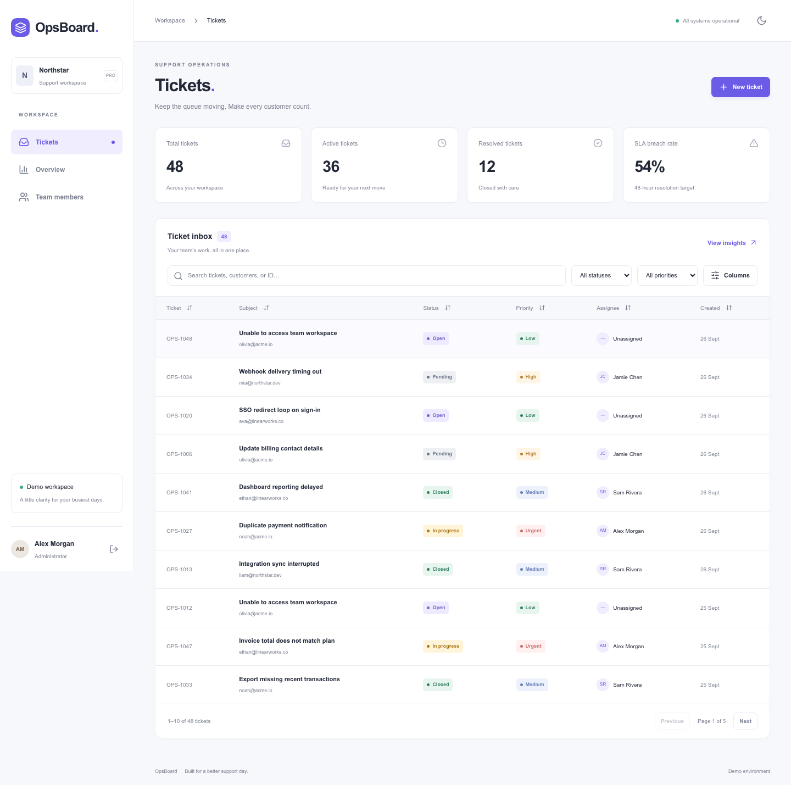

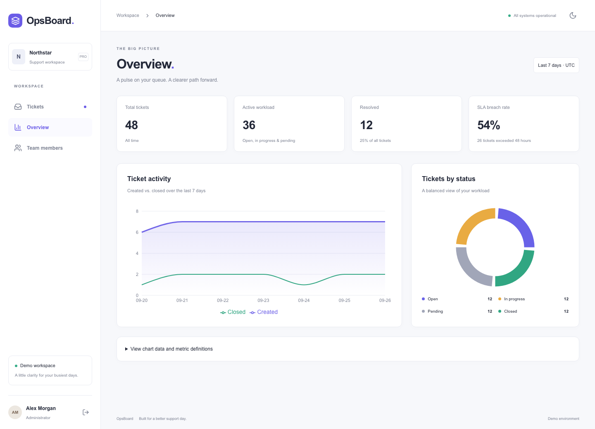

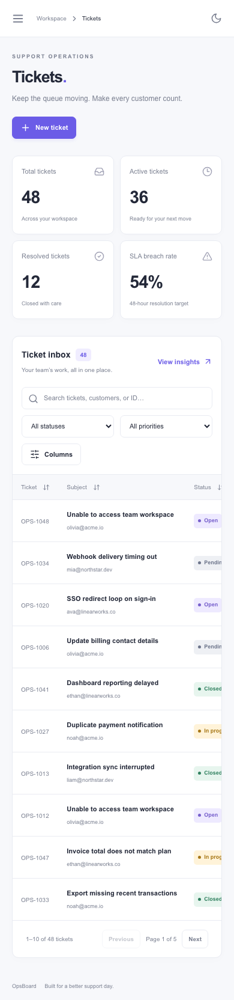

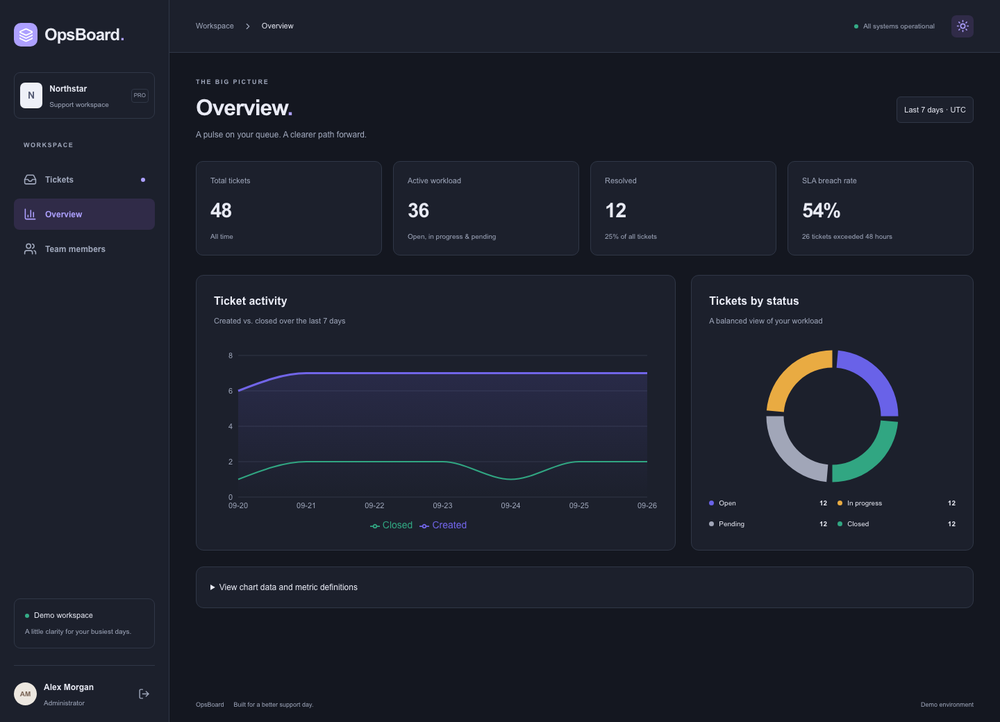

Pagerline visual pass captures:

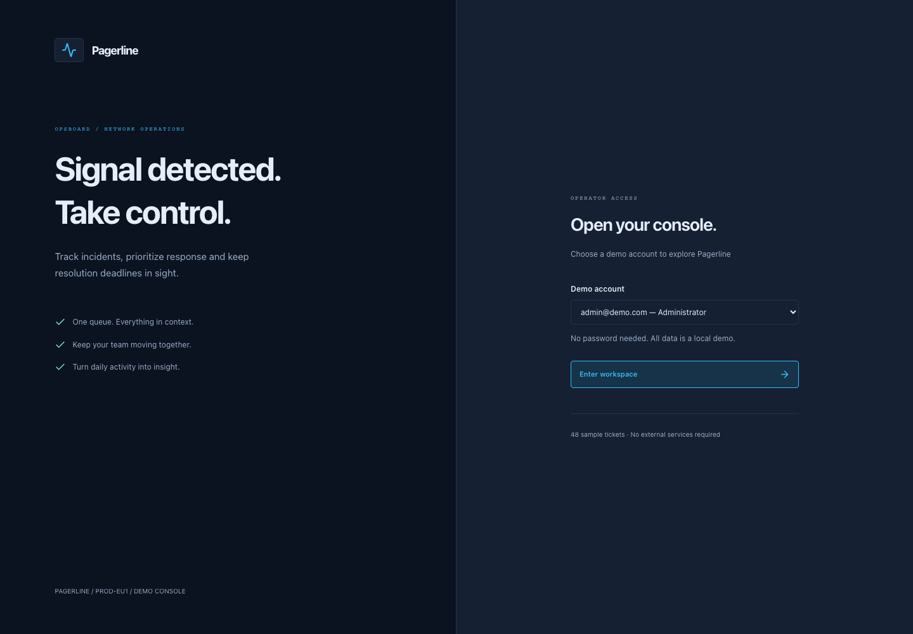
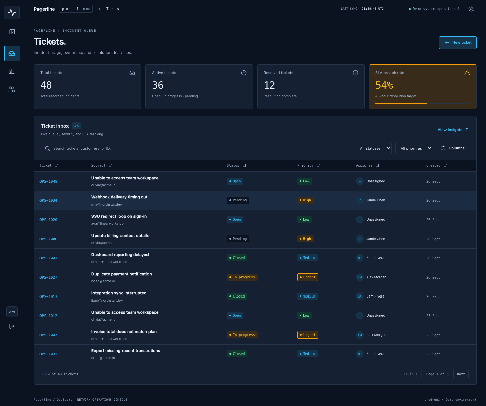
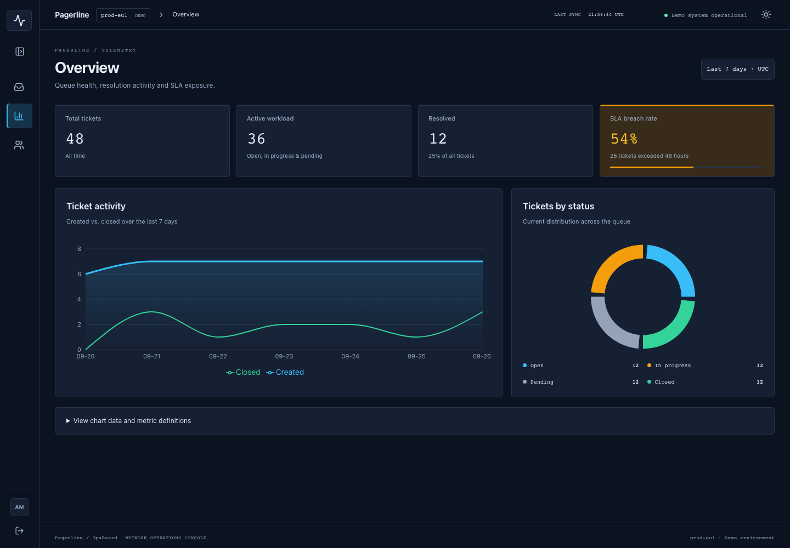
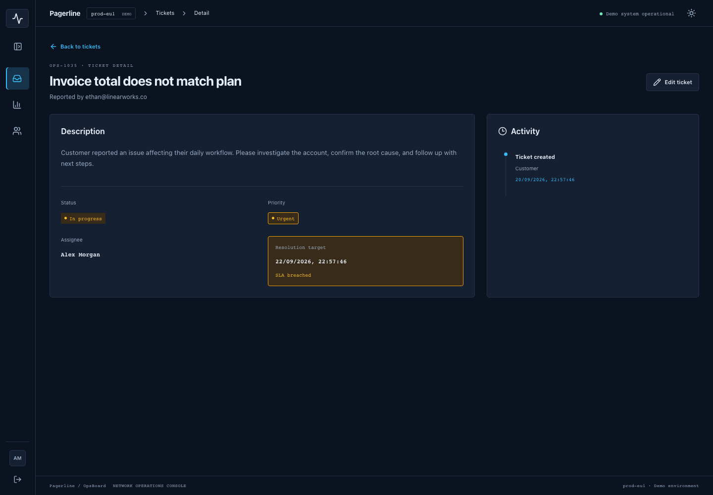
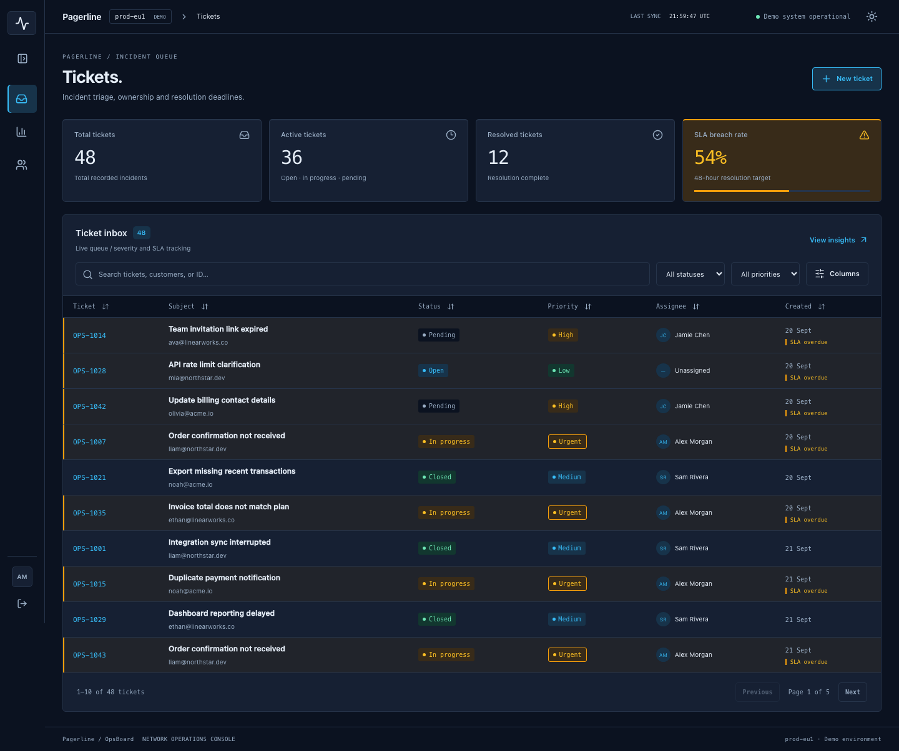
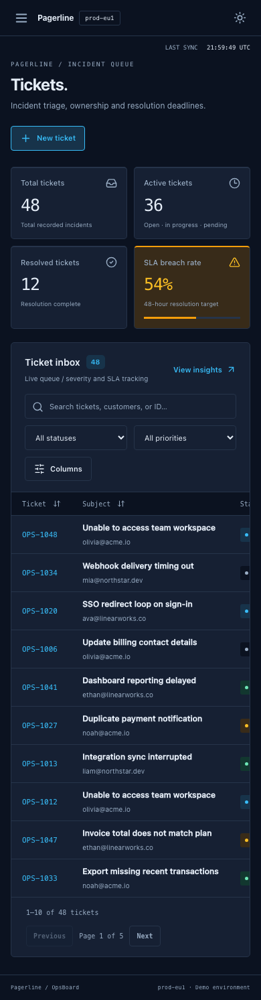
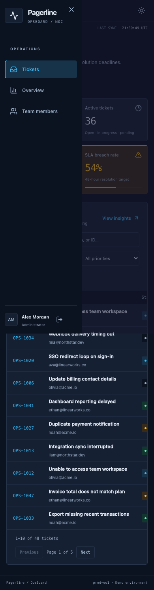
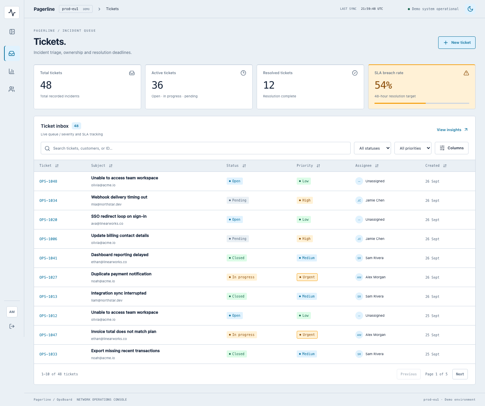

The visual pass uses a dark-first NOC console with Pagerline branding, an icon rail, amber SLA severity, compact KPI tiles, and monospace operational identifiers. Light theme remains available through the theme toggle.

## Deployment

The app is prepared for Vercel. Import this repository into Vercel with the default Next.js build settings; `SESSION_SECRET` is optional for the demo and can be configured for a deployment. Because the API store is in memory, each serverless instance has its own ephemeral ticket state and changes are not durable. For a self-hosted build, run `pnpm build` followed by `pnpm start`.

The app is offline after dependencies are installed: it uses local route handlers and seed data, but the local Next.js server must be running. To run browser smoke tests on a fresh machine, install the Playwright browser once:

```bash
pnpm exec playwright install chromium
pnpm test:e2e
```

## Scope

This MVP deliberately uses an in-memory mock API. It does not include a production database, external identity provider, or native mobile application.

## Validation

The final local checks completed successfully with `pnpm typecheck`, `pnpm lint`, `pnpm test` (15 tests), and `pnpm build`. The admin Playwright smoke flow passed against a clean production server. The agent/mobile smoke scenario still expects the previous light-first control label (`Switch to dark theme`); in the shipped dark-first UI the correct control is `Switch to light theme`.
